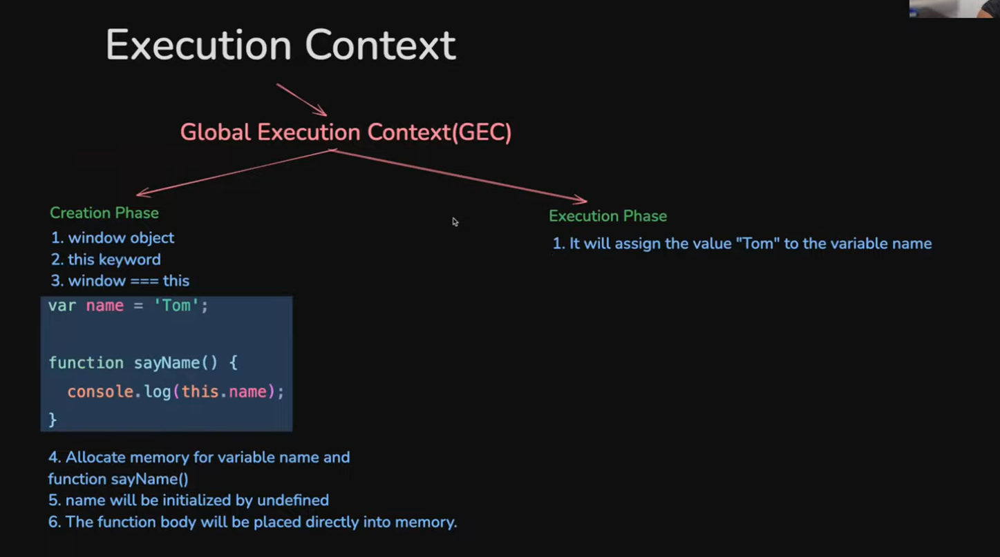
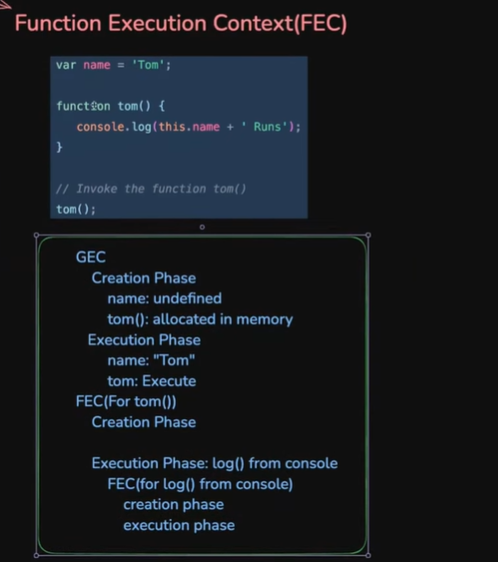
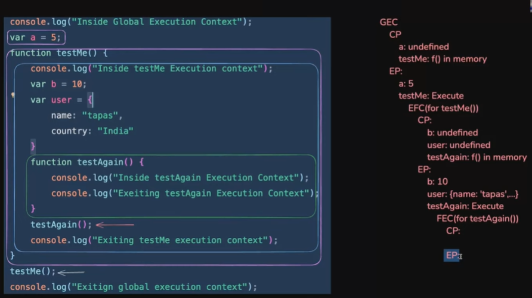

Here are the structured study notes for **Day 8 of the 40 Days of JavaScript Journey**.

---

# 🧠 Day 8: Execution Context & Call Stack

### 🎯 Goal

Deep dive into how JavaScript runs code under the hood. Understand the mechanics of Execution Context, the Call Stack, and memory management (Stack vs. Heap) to build a solid foundation for advanced topics like hoisting, closures, and asynchronous programming.

---

### 1. Core Concepts

#### A. Lexical Environment

* **Definition:** "Where is your code physically written?"
* It refers to the physical placement of code within your file (e.g., a variable declared inside a function vs. outside).
* JavaScript's compiler uses this location to determine **scope** (where variables are accessible) and validate grammar.

#### B. Execution Context (EC)

* **Definition:** "The environment in which the currently running code is executed."
* It contains all the necessary information (variables, functions, the `this` keyword) required to run a specific piece of code.
* **Think of it as a box** that holds the code and its surrounding state while it runs.

---

### 2. Types of Execution Context

#### A. Global Execution Context (GEC)

* The **first** context created when your JS file loads.
* There is only **one** GEC in a JS program.
* Even with an empty file, JS creates a GEC containing:
* The **Global Object** (e.g., `window` in browsers).
* The **`this` keyword** (which points to the Global Object in the GEC).

#### B. Function Execution Context (FEC)

* Created **every time a function is invoked (called)**.
* Each function call creates its **own** brand new FEC.
* Manages the function's local variables, arguments, and its own `this` binding.

---

### 3. Phases of an Execution Context

Every EC goes through two distinct phases when created:

#### Phase 1: Creation Phase (Memory Allocation)

Before executing any code, JS scans the code in the current context.

* **Variables (`var`, `let`, `const`):** Memory is allocated. They are initialized with a special value: **`undefined`**.
* **Functions (Declarations):** The entire function body is stored directly in memory.
* *Note:* This phase is the basis for **Hoisting**.

#### Phase 2: Execution Phase (Code Execution)

JS executes the code line-by-line.

* **Variable Assignment:** The actual values (e.g., `5`, `"Hello"`, object references) are assigned to the variables, replacing `undefined`.
* **Function Calls:** When a function is invoked, code execution **pauses**, a new FEC is created, and the process repeats for that new context.

---

### 4. Memory Management: Stack vs. Heap

JavaScript uses two areas of memory to manage data during execution.

| Memory Type | What it stores | Characteristics |
| --- | --- | --- |
| **Stack (Call Stack)** | Primitive Values, Execution Contexts, References | Fixed size, fast access, LIFO (Last In, First Out) structure. |
| **Heap** | Non-Primitive Values (Objects, Arrays, Functions) | Dynamic, large, unstructured memory pool. Slower access. |

**How they work together:**

* A variable for a **primitive** (like a number) stores its value directly in the **Stack**.
* A variable for an **object** stores a **reference address** in the **Stack**, which points to the actual object data stored in the **Heap**.

[Image showing Stack memory for primitives/references and Heap memory for objects/functions, with pointers connecting them]

---

### 5. The Call Stack in Action

The Call Stack is the mechanism JS uses to track Execution Contexts.

1. **Start:** The stack is empty.
2. **Script Loads:** The **Global Execution Context (GEC)** is pushed onto the stack.
3. **Function Called:** When `funcA()` is called, a new **Function Execution Context (FEC)** for `funcA` is created and pushed on top of the GEC.
4. **Nested Call:** If `funcA` calls `funcB`, an FEC for `funcB` is pushed on top of `funcA`.
5. **Function Returns:** When `funcB` finishes, its FEC is **popped** off the stack. Control returns to `funcA`.
6. **End:** When all functions are done, only the GEC remains until the program/browser tab closes.

[Image series of stack diagrams showing GEC being pushed, then FEC1, then FEC2, then FEC2 popping, FEC1 popping, and back to GEC]

---

### 6. Garbage Collection (A Sneak Peek)

* When an FEC is popped off the stack, references to data in the Heap may be lost.
* If an object in the Heap is no longer reachable (no stack variables point to its address), the **Garbage Collector** will eventually free up that memory.
